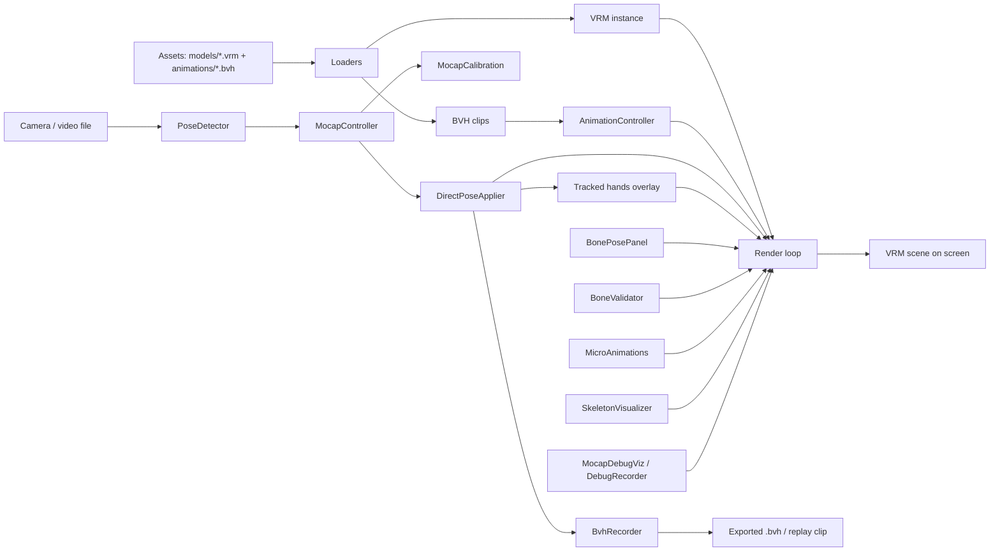

# Архитектура проекта

Это карта проекта на уровне модулей.

Если нужен пользовательский сценарий работы, откройте [user-guide.md](./user-guide.md).

Если нужна диагностика по симптомам, откройте [troubleshooting.md](./troubleshooting.md).

Если нужен подробный разбор мокап-солвера, откройте [mocap-pipeline.md](./mocap-pipeline.md).

## Что это за приложение

Проект — это локальное веб-приложение на `Vite + TypeScript + three.js`, которое:

- загружает VRM-модель;
- проигрывает BVH-анимации;
- накладывает мокап из MediaPipe;
- позволяет записывать результат обратно в BVH;
- даёт много встроенной диагностики для отладки ретаргета.

## Архитектурная схема



## Верхнеуровневые подсистемы

### 1. Загрузка ассетов

Файлы:

- `src/vrmLoader.ts`
- `src/bvhLoader.ts`
- `src/retarget.ts`
- `src/skeletonMap.ts`
- `src/humanoidRestPose.ts`

Роль:

- найти VRM и BVH-файлы;
- загрузить их в runtime;
- превратить BVH в clip, совместимый с текущим VRM;
- применить structural mapping и rest-pose correction.

### 2. Playback и анимационные слои

Файлы:

- `src/animationController.ts`
- `src/priorityAnimator.ts`
- `src/idleLoop.ts`
- `src/microAnimations.ts`

Роль:

- держать очередь анимаций;
- проигрывать BVH через `AnimationMixer`;
- подмешивать idle и мелкие procedural-эффекты;
- работать как базовый слой позы до мокапа.

### 3. Мокап

Файлы:

- `src/mocap/poseDetector.ts`
- `src/mocap/mocapController.ts`
- `src/mocap/mocapCalibration.ts`
- `src/mocap/directPoseApplier.ts`
- `src/mocap/twoBoneIK.ts`
- `src/mocap/faceApplier.ts`
- `src/mocap/oneEuroFilter.ts`

Роль:

- получить landmarks из камеры или видео;
- вычислить scale и пропорции перформера;
- преобразовать landmarks в позу аватара;
- решить IK для рук и ног;
- отдельно обработать лицо, кисти и пальцы.

### 4. Debug и инструменты анализа

Файлы:

- `src/debugPanel.ts`
- `src/mocap/mocapDebugViz.ts`
- `src/mocap/mocapDebugRecorder.ts`
- `src/skeletonVisualizer.ts`

Роль:

- показать runtime-переключатели;
- отрисовать performer/debug skeleton;
- собирать `Skeleton Info`;
- писать JSON-лог для глубокого разбора.

### 5. Manual authoring и validation

Файлы:

- `src/bonePosePanel.ts`
- `src/validation/boneValidator.ts`
- `src/validation/boneConstraints.ts`
- `src/validation/clipValidator.ts`

Роль:

- дать ручные оффсеты поверх мокапа и анимации;
- clamp-ить authored pose по ROM;
- проверять клипы и итоговые кости на разумные пределы.

### 6. UI и сцена

Файлы:

- `src/main.ts`
- `src/scene.ts`
- `src/ui.ts`

Роль:

- собрать приложение;
- создать сцену, камеру, рендерер и orbit controls;
- смонтировать библиотеку, очередь, debug UI и render loop.

## Точка входа

Главная точка входа — `src/main.ts`.

Что происходит внутри `main()`:

1. Создаётся three.js сцена.
2. Загружается VRM.
3. Поднимаются procedural-системы, validator, skeleton overlays и debug tools.
4. Создаётся `MocapController`.
5. Загружаются BVH-клипы и регистрируются в `AnimationController`.
6. Монтируются transport, library, queue и debug panel.
7. Запускается render loop.

## Порядок слоёв в кадре

На каждом тике кадр собирается не одним solver-ом, а несколькими слоями.

Порядок такой:

1. `AnimationController.update(delta)`
2. `IdleLoop` и `PriorityAnimator`, если BVH не активен
3. `mocap.applyLatestFrame()`
4. `bonePanel.apply()`
5. `mocap.applyTrackedHandsOverlay()`
6. `validator.clampAll(...)`
7. `dbgRecorder.capture(...)`
8. `mocapDebugViz.update(...)`
9. `micro.update(vrm)`
10. `vrm.update(delta)`
11. `skelViz.update()`

Это один из самых важных архитектурных фактов проекта: порядок слоёв часто важнее, чем сами коэффициенты solver-а.

## Поток данных для BVH

### Входящий BVH

```text
.bvh file
  -> bvhLoader
  -> retargetBvhToVrm
  -> AnimationController.register
  -> queue / playback
```

### Исходящий BVH

```text
live mocap / current avatar pose
  -> MocapController
  -> BvhRecorder
  -> downloadBvh
  -> optional auto-replay as new clip
```

Особый случай:

- `exportCurrentPoseBvh()` создаёт временный recorder и сохраняет только один кадр;
- основной recorder при этом не трогается.

## Поток данных для мокапа

```text
camera or file
  -> PoseDetector
  -> latestFrame
  -> MocapCalibration
  -> DirectPoseApplier
  -> final hand overlay
  -> validator
  -> VRM scene
```

Внутри `DirectPoseApplier` данные обычно проходят такие этапы:

1. hips basis
2. spine/chest bend
3. arm IK
4. leg IK
5. hand / finger overlay
6. face blendshapes
7. debug target capture

## Что от чего зависит

### Сильные связи

- `main.ts` знает почти про все основные системы;
- `MocapController` зависит от `PoseDetector`, `MocapCalibration`, `DirectPoseApplier` и `BvhRecorder`;
- `DirectPoseApplier` зависит от кэша humanoid bones и calibration.

### Относительно независимые зоны

- загрузка VRM/BVH;
- playback и queue;
- debug UI;
- запись BVH.

Это полезно для рефакторинга: не всё в проекте связано со всем.

## Language host preview

Language hosts previewed in separate top-level `Hosts` tab. Tab uses
`src/languageHosts.ts` -> `LanguageHostProfile` records, then mounts
`LanguageHostsPage.vue` owning isolated Three.js preview scene through
`createLanguageHostPreviewScene()`.

Hosts tab does not replace active VRM in Player tab. It has own scene, camera,
renderer, controls, render loop, and `AvatarCharacterManager`.

Main player modules (`vrmModule`, `playbackModule`, `toolingModule`,
`mocapModule`, `renderLoopModule`) continue to use normal player VRM selected by
startup/upload flow.

## Главные runtime-объекты

### `AnimationController`

Отвечает за очередь анимаций и кроссфейды.

### `MocapController`

Главный фасад мокапа. Именно его удобно считать "API" мокап-системы для остального приложения.

### `DirectPoseApplier`

Сердце solver-а. Если есть баг в торсе, руках, кистях или ногах, чаще всего смотреть нужно сюда.

### `BoneValidator`

Последний guardrail перед финальной позой.

### `DebugPanel`

Внешняя точка входа для человека, который отлаживает систему в браузере.

## Где чаще всего возникают архитектурные баги

### 1. Неправильный порядок слоёв

Симптом:

- один слой "не виден", хотя расчёт вроде правильный.

Причина:

- более поздний слой перетёр кость.

### 2. Смешение responsibility

Симптом:

- одна и та же проблема чинится коэффициентами в трёх местах.

Причина:

- torso-логика живёт частично в hips, частично в spine, частично в arm target.

### 3. Debug-логика не совпадает с authored pose

Симптом:

- debug skeleton показывает одно, модель делает другое.

Причина:

- debug снимается до финального overlay или до validator-а.

### 4. Калибровка влияет на solver сильнее, чем кажется

Симптом:

- визуально проблема похожа на плохой IK.

Причина:

- ошибка на самом деле появилась раньше, в `armScale`, `bodyScale` или `legScale`.

## Как лучше читать код

Если вы только входите в проект, лучший порядок такой:

1. `src/main.ts`
2. `src/mocap/mocapController.ts`
3. `src/mocap/directPoseApplier.ts`
4. `src/debugPanel.ts`
5. `src/retarget.ts`
6. `src/validation/boneValidator.ts`

Если задача именно по мокапу:

1. [mocap-pipeline.md](./mocap-pipeline.md)
2. `src/mocap/directPoseApplier.ts`
3. [troubleshooting.md](./troubleshooting.md)

## Что можно улучшить дальше

- выделить архитектурно отдельный `PoseSolver` слой между `MocapController` и `DirectPoseApplier`;
- разделить torso, arm, leg и hand solver-ы по файлам;
- вынести debug metrics в типизированный объект уровня `solverDiagnostics`;
- разделить пользовательскую UI и engineering debug UI;
- добавить автоматические regression-сцены для типовых поз.
